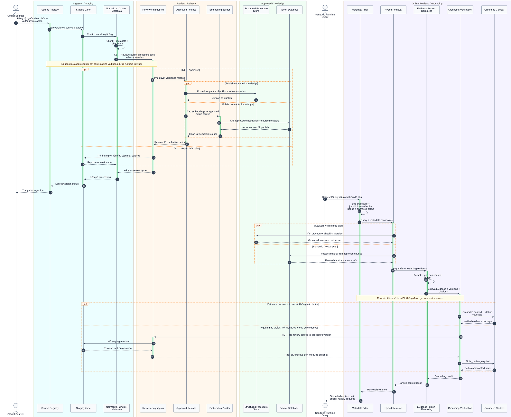

# Kiến trúc vendor-neutral — AI Procedure Copilot

> **Trạng thái:** Working proposal, chưa phải kiến trúc đã triển khai.
>
> **Task Record:** `local-20260717-vendor-neutral-architecture` — `risk:shared`, mode `verify-demo`, status `handoff`.
>
> **Phạm vi:** Tài liệu nội bộ phục vụ team kỹ thuật và trình bày với giám khảo.
>
> **Không thay thế:** [Project Context](../docs/ai/PROJECT_CONTEXT.md), [Architecture source-of-truth](../docs/ai/ARCHITECTURE.md) hoặc D-006 trong [Decision Log](../docs/ai/DECISIONS.md).

Tài liệu mô tả kiến trúc theo **năng lực**, không chọn framework, database, nhà cung cấp mô hình hoặc nền tảng triển khai. Delivery surface theo D-008 là standalone web app + widget/iframe + headless API; không có mobile/native flow. [`diagram_v3.mmd`](diagram_v3.mmd) là input thiết kế cho API Gateway, PII Guard, LLM Gateway và redacted audit; ví dụ thủ tục/scrape trong file đó không thay D-007 hoặc data governance hiện hành. Account memory lưu full draft trong 30 ngày là kiến trúc mục tiêu, chỉ được triển khai sau khi có Decision mới và privacy/security review vì khác với [data policy hiện tại](../docs/ai/SECRETS_AND_DATA.md).

## 1. Nguyên tắc thiết kế

1. **Procedure Copilot, không phải chatbot tổng quát:** hội thoại chỉ là giao diện; hướng dẫn phải dựa trên procedure pack đã review.
2. **Tách AI khỏi quyết định nghiệp vụ:** mô hình ngôn ngữ hỏi làm rõ và giải thích; rule engine quyết định finding kiểm tra sơ bộ.
3. **Grounded by construction:** nội dung quy phạm phải có nguồn, phiên bản, ngày xác minh và trust state.
4. **Knowledge khác memory:** RAG lưu tri thức thủ tục công khai; memory lưu trạng thái phiên/hồ sơ của từng người dùng. PII không đi vào embeddings hoặc vector database.
5. **Human-in-the-loop:** nguồn/rules phải được reviewer nghiệp vụ duyệt; người dùng phải xác nhận các điểm có thể làm thay đổi thủ tục, checklist, dữ liệu lưu và kết quả pre-check.
6. **Fail closed:** thiếu căn cứ, nguồn mâu thuẫn hoặc ngoài phạm vi thì chuyển `official_review_required`, không tự hoàn tất câu trả lời.
7. **PII không rời trust boundary:** raw form chỉ dùng cho xử lý nội bộ; external LLM chỉ nhận context đã giảm thiểu/tokenize và không được tạo hoặc đổi validation finding.

## 2. Kiến trúc phân tầng

```mermaid
%%{init: {"theme":"base","themeVariables":{"actorBkg":"#F8FAFC","actorBorder":"#64748B","actorTextColor":"#0F172A","signalColor":"#334155","signalTextColor":"#0F172A","labelBoxBkgColor":"#FFF7ED","labelBoxBorderColor":"#FB923C","labelTextColor":"#7C2D12","noteBkgColor":"#FEFCE8","noteBorderColor":"#EAB308","noteTextColor":"#422006","activationBkgColor":"#DBEAFE","activationBorderColor":"#2563EB"},"sequence":{"mirrorActors":true,"useMaxWidth":false,"wrap":true,"diagramMarginX":20,"diagramMarginY":10,"actorMargin":50,"width":170,"height":55,"boxMargin":10,"boxTextMargin":5,"noteMargin":10,"messageMargin":32}}}%%
sequenceDiagram
    autonumber
    actor U as Người dùng / Portal host

    box rgb(236,254,255) Tầng Web FE
        participant FE as Web App / Widget / Form / Trust UI
    end

    box rgb(255,247,237) Tầng BE — Trust & Orchestration
        participant BND as API Gateway / Service Boundary
        participant ID as Identity & Access
        participant ORCH as Conversation Orchestrator
        participant MEM as Memory Manager
        participant PG as Session-scoped PII Guard
        participant LLM as Provider-neutral LLM Gateway
        participant RULE as Deterministic Rule Engine
        participant POL as Trust / Response Policy
        participant AUD as Redacted Audit
    end

    box rgb(245,243,255) Memory & Security
        participant SM as Browser Session Memory
        participant LM as Encrypted Case Memory
        participant KEY as Key Management
    end

    box rgb(240,253,244) Tầng RAG / Knowledge
        participant Q as Query Preparation
        participant RET as Hybrid Retrieval
        participant STRUCT as Structured Procedure Store
        participant VEC as Vector Database
        participant VERIFY as Grounding Verification
    end

    U->>FE: Mô tả nhu cầu / nhập dữ liệu form
    FE->>+BND: SessionContext + input có cấu trúc
    Note over FE,BND: Guardrail FE/Boundary — consent, schema, size, scope, auth và rate checks
    BND->>+ID: Xác thực account và quyền truy cập case
    ID-->>-BND: Identity / authorization result
    BND->>AUD: Ghi request metadata đã redacted
    BND->>+ORCH: Chuyển input đã xác thực

    ORCH->>+MEM: Đọc trạng thái phiên
    MEM->>SM: Lấy short-term context
    SM-->>MEM: Recent turns + form/review state
    opt Người dùng yêu cầu resume case
        MEM->>LM: Lấy encrypted CaseSnapshot
        LM->>KEY: Kiểm tra key reference và quyền giải mã
        KEY-->>LM: Decryption authorization
        LM-->>MEM: Structured case state
    end
    MEM-->>-ORCH: Session / case context

    ORCH->>+Q: RetrievalQuery đã giảm thiểu dữ liệu
    Note over Q,VERIFY: Guardrail RAG — không PII, chỉ approved sources và metadata hợp lệ
    Q->>+RET: Query + procedure / jurisdiction / effective-date filters
    par Structured / keyword path
        RET->>STRUCT: Lookup procedure pack và rules
        STRUCT-->>RET: Versioned structured evidence
    and Semantic path
        RET->>VEC: Vector similarity trên approved knowledge
        VEC-->>RET: Ranked public-source chunks
    end
    RET->>+VERIFY: Fused / reranked evidence
    VERIFY-->>-RET: Citations + freshness + conflict state
    RET-->>-Q: RetrievalEvidence
    Q-->>-ORCH: Grounded evidence

    alt Evidence đủ và không mâu thuẫn
        ORCH->>+RULE: Form state + deterministic rules
        RULE-->>-ORCH: Findings + rule references
        opt Cần clarification hoặc giải thích ngôn ngữ đơn giản
            ORCH->>PG: Minimize và tokenize direct identifiers
            PG-->>ORCH: Context an toàn + token map in-memory theo phiên
            ORCH->>LLM: Evidence + findings + context đã tokenize
            LLM-->>ORCH: Structured clarification / explanation
            ORCH->>PG: Khôi phục token chỉ cho trusted response
            PG-->>ORCH: Display-safe model output
        end
        ORCH->>+POL: Guidance + evidence + deterministic findings
        Note over PG,POL: Raw identifier không tới external LLM, token map không vào log, DB, vector hoặc CaseSnapshot
        Note over RULE,POL: Model không tạo/đổi finding hoặc quyết định hồ sơ hợp lệ; output quy phạm bắt buộc có citations
        POL->>AUD: Ghi trust outcome đã redacted
        POL-->>-ORCH: GroundedResponse + trust state
    else Thiếu evidence / nguồn mâu thuẫn
        ORCH->>+POL: Yêu cầu fail-closed escalation
        POL->>AUD: Ghi official-review signal
        POL-->>-ORCH: official_review_required
    end

    ORCH->>MEM: Proposed memory update
    MEM->>SM: Cập nhật short-term state
    ORCH-->>-BND: GroundedResponse
    BND-->>-FE: Guidance / checklist / findings / review gate
    FE-->>U: Hiển thị kết quả có nguồn và yêu cầu người dùng review
```

### Tầng Web FE

| Năng lực | Trách nhiệm |
| --- | --- |
| Chat và clarification | Nhận nhu cầu tự nhiên, hiển thị câu hỏi làm rõ theo từng bước. |
| Dynamic form | Hiển thị form từ schema, gắn lỗi theo field/cross-field và cho phép sửa. |
| Portal integration | Cung cấp standalone web app, widget/iframe và headless API; kiểm container/overflow/CSP/CORS. |
| Trust display | Hiển thị source refs, procedure version, `last_verified_at` và trust state. |
| Review checkpoints | Buộc người dùng xác nhận procedure, checklist, dữ liệu form và báo cáo pre-check. |
| Memory controls | Giải thích consent/retention, cho phép save, resume, logout và xóa case. |

Web FE không tự quyết định procedure, checklist hoặc tính hợp lệ; nó chỉ thu thập, trình bày và ghi nhận xác nhận của người dùng. Không có native mobile/PWA install/app-store surface trong MVP.

### Tầng BE / Trust & Orchestration

| Năng lực | Trách nhiệm |
| --- | --- |
| Identity và access | Xác thực account, kiểm tra quyền theo user/case và cô lập tenant. |
| API Gateway / service boundary | Kiểm auth, schema, size, rate, scope và routing trước khi vào orchestration. |
| Conversation orchestrator | Điều phối intent, clarification, retrieval, memory và response state. |
| Memory manager | Tách short/long memory, mã hóa case, kiểm soát save/resume/delete/expiry. |
| PII Guard | Giảm thiểu/tokenize direct identifiers trước external model; token map chỉ in-memory trong phiên. |
| LLM Gateway | Gọi model qua adapter trung lập để hỏi làm rõ hoặc giải thích structured evidence/findings. |
| Deterministic rule engine | Kiểm tra required, type/format, conditional và cross-field conflict. |
| Trust policy | Chỉ cho phép grounded response; kiểm tra citations/freshness và chọn trust state. |
| Redacted audit | Ghi actor, action, case reference, thời điểm và kết quả; không ghi raw form/PII. |

### Tầng RAG / Knowledge

| Năng lực | Trách nhiệm |
| --- | --- |
| Source registry | Quản lý nguồn chính thức, authority, effective dates, checksum và review status. |
| Structured procedure store | Lưu procedure pack, checklist, form schema, validation rules và version. |
| Vector database | Lưu embeddings của **nguồn công khai đã approved**; tuyệt đối không chứa PII hoặc chat memory. |
| Query preparation | Giảm thiểu dữ liệu, loại identifier không cần thiết và thêm metadata filters. |
| Hybrid retrieval | Kết hợp keyword/structured lookup với vector similarity. |
| Reranking/context builder | Chọn evidence phù hợp procedure, jurisdiction, hiệu lực và câu hỏi hiện tại. |
| Grounding verification | Kiểm tra citation coverage, source conflicts, freshness và ngưỡng đủ căn cứ. |

## 3. RAG lifecycle và vector database



### Ingestion path

1. Chỉ nhận nguồn từ allowlist chính thức vào source registry.
2. Lưu bản staging, chuẩn hóa định dạng, loại trùng và gắn metadata: procedure, jurisdiction, authority, effective period, source URL/ref, checksum.
3. Reviewer nghiệp vụ đối chiếu nguồn, procedure pack, form schema và validation rules.
4. Chỉ release `approved` mới được tạo embeddings và publish vào vector database/structured store phục vụ runtime.
5. Thay đổi nguồn tạo version mới; version cũ được đánh dấu inactive/superseded thay vì ghi đè mất lịch sử.

### Online retrieval path

1. Query preparation chỉ giữ dữ kiện cần để tìm thủ tục; identifier và raw form values không được gửi vào vector search.
2. Metadata filter loại pack sai jurisdiction, ngoài effective period hoặc chưa approved.
3. Hybrid retrieval kết hợp structured/keyword results với semantic results.
4. Reranker chọn evidence phù hợp và giới hạn context; không đưa toàn bộ source vào model.
5. Grounding verifier yêu cầu source refs, version và freshness cho mọi phát biểu quy phạm.
6. Không đủ evidence hoặc có conflict thì không generate hướng dẫn mới; trả `official_review_required`.

## 4. Chat flow, memory và review gates

```mermaid
%%{init: {"theme":"base","themeVariables":{"actorBkg":"#F8FAFC","actorBorder":"#64748B","actorTextColor":"#0F172A","signalColor":"#334155","signalTextColor":"#0F172A","labelBoxBkgColor":"#FFF7ED","labelBoxBorderColor":"#FB923C","labelTextColor":"#7C2D12","noteBkgColor":"#FEFCE8","noteBorderColor":"#EAB308","noteTextColor":"#422006","activationBkgColor":"#EDE9FE","activationBorderColor":"#7C3AED"},"sequence":{"mirrorActors":true,"useMaxWidth":false,"wrap":true,"diagramMarginX":20,"diagramMarginY":10,"actorMargin":50,"width":170,"height":55,"boxMargin":10,"boxTextMargin":5,"noteMargin":10,"messageMargin":32}}}%%
sequenceDiagram
    autonumber
    actor U as Người dùng

    box rgb(236,254,255) Tầng Web FE
        participant FE as Web App / Widget / Review UI
    end

    box rgb(255,247,237) Tầng BE — Trust & Orchestration
        participant BND as API Gateway / Service Boundary
        participant ID as Identity & Access
        participant ORCH as Conversation Orchestrator
        participant MEM as Memory Manager
        participant PG as Session-scoped PII Guard
        participant LLM as Provider-neutral LLM Gateway
        participant RULE as Deterministic Rule Engine
        participant POL as Trust / Response Policy
        participant AUD as Redacted Audit
    end

    box rgb(245,243,255) Memory & Security
        participant SM as Browser Session Memory
        participant LM as Encrypted Case Memory
        participant KEY as Key Management
    end

    box rgb(240,253,244) Tầng RAG / Knowledge
        participant RAG as Approved Knowledge / Retrieval
    end

    U->>FE: Mô tả nhu cầu hoặc yêu cầu resume
    FE->>BND: Input + SessionContext
    BND->>+ID: Xác thực account và quyền truy cập
    ID-->>-BND: Authentication / authorization result

    alt Authentication / authorization thất bại
        BND->>AUD: Ghi access failure đã redacted
        BND-->>FE: Không trả draft, yêu cầu đăng nhập hoặc recovery
        FE-->>U: Hiển thị safe recovery path
    else Đã xác thực
        BND->>ORCH: Chuyển input đã qua boundary checks
        ORCH->>+MEM: Load short-term state
        MEM->>SM: Đọc recent turns + form/review state
        SM-->>MEM: SessionContext

        opt Người dùng yêu cầu resume case
            Note over MEM,KEY: S1 — Account memory chỉ được bật sau privacy/security review và Decision mới
            MEM->>LM: Lấy encrypted CaseSnapshot
            LM->>KEY: Kiểm tra key reference và quyền giải mã
            alt Auth/decryption hợp lệ
                KEY-->>LM: Cho phép unwrap data key
                LM-->>MEM: Decrypted structured CaseSnapshot
                MEM-->>ORCH: Case state + saved procedure/source versions
                ORCH->>+RAG: So sánh saved version với active approved version
                RAG-->>-ORCH: Active version + freshness metadata
                alt Procedure/source version đã đổi
                    ORCH-->>BND: Mark stale + changed-source summary
                    BND-->>FE: U5 — Yêu cầu review và revalidate
                    FE-->>U: Hiển thị thay đổi có nguồn
                    U->>FE: Xác nhận U5
                    FE->>BND: Revalidate confirmation
                    BND->>ORCH: Tiếp tục bằng active version
                else Version không đổi
                    Note over U,RAG: Cho phép tiếp tục draft với last_verified_at hiện tại
                end
            else Auth/decryption lỗi
                KEY-->>LM: Từ chối giải mã
                LM-->>MEM: Resume failure, không trả plaintext
                MEM->>AUD: Ghi decryption failure đã redacted
                MEM-->>ORCH: Bắt đầu empty session hoặc recovery
            end
        end
        MEM-->>-ORCH: Session / case context đã hợp nhất

        alt Guardrails cho phép xử lý input
            ORCH->>RAG: RetrievalQuery đã giảm thiểu dữ liệu
            alt Có approved evidence, còn hiệu lực và không mâu thuẫn
                RAG-->>ORCH: RetrievalEvidence + citations + freshness
                ORCH->>PG: Giảm thiểu và tokenize identifier trong free text
                PG-->>ORCH: Safe model context + token map theo phiên
                ORCH->>LLM: Evidence + structured intent / clarification request
                alt LLM Gateway hoạt động
                    LLM-->>ORCH: Structured procedure candidate / question
                    ORCH->>PG: De-tokenize display fields tại trusted boundary
                    PG-->>ORCH: Display-safe structured output
                else LLM lỗi hoặc timeout
                    LLM-->>ORCH: Provider failure
                    Note over ORCH,LLM: Dùng structured evidence để hỏi lại hoặc trả checklist; không gửi raw data để retry
                end
                ORCH->>+POL: Procedure đề xuất / clarification + evidence
                POL->>AUD: Ghi trust state đã redacted
                POL-->>-ORCH: GroundedResponse
                ORCH-->>BND: Procedure / clarification response
                BND-->>FE: Procedure + source refs + review gate
                FE-->>U: U1 — Review và xác nhận procedure

                U->>FE: Xác nhận U1 + clarification answers
                FE->>BND: Structured answers
                BND->>ORCH: Cập nhật intent / clarification state
                ORCH->>+RAG: Lấy checklist và steps có nguồn
                RAG-->>-ORCH: Versioned checklist evidence

                ORCH->>+POL: Checklist + citations + trust metadata
                POL->>AUD: Ghi guidance outcome đã redacted
                POL-->>-ORCH: verified_guidance / need_more_information
                ORCH-->>BND: Checklist response
                BND-->>FE: Checklist + trust state
                FE-->>U: U2 — Review checklist và nguồn

                U->>FE: Điền hoặc sửa form
                FE->>BND: Structured form state
                BND->>ORCH: Validation request
                ORCH->>+RULE: Form state + deterministic rules
                RULE-->>-ORCH: Findings + rule/source references
                opt Cần giải thích finding bằng ngôn ngữ đơn giản
                    ORCH->>PG: Tokenize identifiers trong findings/context
                    PG-->>ORCH: Tokenized explanation payload
                    ORCH->>LLM: Giải thích findings cố định, không tạo finding mới
                    LLM-->>ORCH: Suggested wording tham chiếu finding IDs
                    ORCH->>PG: De-tokenize phần hiển thị trong trusted boundary
                    PG-->>ORCH: Display-safe explanation
                end
                ORCH->>+POL: Findings + grounded explanation
                Note over PG,POL: Token map chỉ in-memory trong phiên; không log, DB, disk, vector hoặc CaseSnapshot
                Note over RULE,POL: Rule Engine tạo field/cross-field findings; mô hình không được thay finding hoặc quyết định hồ sơ hợp lệ
                POL->>AUD: Ghi validation outcome đã redacted
                POL-->>-ORCH: Pre-check report
                ORCH-->>BND: Validation response
                BND-->>FE: Findings + fixes + trust state
                FE-->>U: U3 — Review dữ liệu và findings

                U->>FE: Chọn lưu hoặc xóa draft
                FE-->>U: U4 — Consent, retention 30 ngày và delete control
                alt Người dùng chọn lưu
                    U->>FE: Xác nhận lưu
                    FE->>BND: Save CaseSnapshot request
                    BND->>+ID: Authorize account / case write
                    ID-->>-BND: Write authorization result
                    alt Có quyền lưu
                        BND->>+MEM: Save full draft
                        Note over MEM,PG: CaseSnapshot không chứa token map, prompt payload hoặc model-internal state
                        MEM->>+KEY: Tạo và wrap data key riêng theo case
                        KEY-->>-MEM: Wrapped-key reference
                        MEM->>LM: Ghi ciphertext + expiry metadata
                        LM-->>MEM: Case reference + expires_at
                        MEM->>AUD: Ghi save event đã redacted
                        MEM-->>-BND: Save result
                        BND-->>FE: Resume reference + expiry
                        FE-->>U: Xác nhận lưu thành công
                    else Không có quyền lưu
                        BND->>AUD: Ghi denied write đã redacted
                        BND-->>FE: Không tạo hoặc thay đổi CaseSnapshot
                        FE-->>U: Yêu cầu đăng nhập/recovery
                    end
                else Người dùng chọn xóa
                    U->>FE: Xác nhận xóa
                    FE->>BND: Delete case/session request
                    BND->>+ID: Authorize delete
                    ID-->>-BND: Delete authorization result
                    alt Có quyền xóa
                        BND->>+MEM: Delete case và session copies
                        MEM->>LM: Xóa ciphertext
                        LM-->>MEM: Ciphertext deletion result
                        MEM->>KEY: Xóa wrapped-key reference
                        KEY-->>MEM: Key deletion result
                        MEM->>SM: Xóa browser session context
                        SM-->>MEM: Session cleared
                        BND->>PG: Hủy token map của phiên
                        PG-->>BND: Session token map cleared
                        MEM->>AUD: Ghi delete event đã redacted
                        MEM-->>-BND: Deletion result
                        BND-->>FE: Xác nhận đã xóa
                        FE-->>U: Case/session không còn khả dụng
                    else Không có quyền xóa
                        BND->>AUD: Ghi denied delete đã redacted
                        BND-->>FE: Không tiết lộ case metadata
                        FE-->>U: Yêu cầu đăng nhập/recovery
                    end
                end
            else Retrieval lỗi / thiếu evidence / nguồn mâu thuẫn
                RAG-->>ORCH: Retrieval failure hoặc conflict state
                ORCH->>+POL: Fail-closed escalation
                POL->>AUD: Ghi official-review signal
                POL-->>-ORCH: official_review_required
                ORCH-->>BND: Safe escalation response
                BND-->>FE: Nguồn/kênh chính thức + giới hạn
                FE-->>U: Dừng flow và chuyển official review
            end
        else Guardrail chặn input
            ORCH->>+POL: Safe response, không đề xuất memory update
            POL->>AUD: Ghi blocked event đã redacted
            POL-->>-ORCH: Blocked input response
            ORCH-->>BND: Safe response
            BND-->>FE: Thông báo và cách sửa input
            FE-->>U: Không lưu blocked content
        end
        opt Logout hoặc session hết hạn
            BND->>PG: Hủy token map in-memory
            PG-->>BND: Session token map cleared
        end
    end
```

## 5. Memory model

### Phân biệt bốn loại state

| Loại | Mục đích | Có PII? | Persistence |
| --- | --- | --- | --- |
| Knowledge/RAG | Tri thức thủ tục công khai đã review | Không | Versioned theo source lifecycle |
| Short-term memory | Giữ mạch hội thoại và form trong phiên hiện tại | Có thể có trong browser session | Xóa khi logout/delete/đóng tab hoặc trình duyệt |
| PII token map | Ánh xạ identifier ↔ token tạm trước external LLM | Có, chỉ trong trusted BE | In-memory theo phiên; hủy khi logout/delete/expiry; không durable |
| Long-term case memory | Resume full draft trên nhiều thiết bị | Có, được mã hóa | Tối đa 30 ngày sau lần hoạt động cuối |

### Short-term memory — browser session

**Nên lưu:**

- Recent user/assistant turns cần cho hội thoại hiện tại.
- Conversation summary có cấu trúc, không chứa chain-of-thought.
- Procedure candidate/confirmed procedure, version và jurisdiction.
- Pending clarification questions và structured answers.
- Form state hiện tại và thay đổi chưa lưu.
- Retrieval evidence references, không sao chép toàn bộ source.
- Validation findings, trust state và review checkpoint hiện tại.

**Không lưu:**

- Chain-of-thought, system prompt hoặc hidden model state.
- Raw source documents, embeddings hoặc secret.
- Dữ liệu của account/case khác.
- Log raw request/response phía backend.
- PII token map; state này chỉ thuộc PII Guard phía BE và không được serialize về browser.

Short-term state nằm trong browser session. Backend chỉ dựng execution context trong lúc xử lý request và không dùng nó làm durable memory. Logout, explicit delete hoặc đóng tab/trình duyệt phải kết thúc phiên; nếu browser phục hồi tab thì FE vẫn phải kiểm tra authentication và case version trước khi tiếp tục.

### Long-term case memory — resume qua account web

**CaseSnapshot được phép lưu:**

- `account_id`, `case_id`, procedure ID/version và jurisdiction.
- Full form draft, bao gồm giá trị cần resume, dưới dạng ciphertext.
- Structured clarification answers.
- Checklist/progress và bước hiện tại.
- Validation findings, resolution state và thời điểm kiểm tra gần nhất.
- User confirmations cho procedure, checklist, form và save consent.
- Source/procedure versions đã dùng để tạo guidance.
- `created_at`, `updated_at`, `last_accessed_at`, `expires_at` và deletion status.
- Key reference và audit event references; không lưu plaintext key cùng ciphertext.

**Không lưu:**

- Full chat transcript nếu structured summary đã đủ để resume.
- Chain-of-thought hoặc prompt nội bộ.
- Embeddings của form, chat hoặc PII.
- Raw PII trong analytics, search index, audit log hoặc vector database.
- PII token map, model request/response gốc hoặc khóa tokenization theo phiên.
- Draft quá 30 ngày không hoạt động.

### Envelope encryption lifecycle

1. Tạo data-encryption key riêng theo case.
2. Mã hóa toàn bộ CaseSnapshot trước khi ghi vào case store.
3. Bọc data key bằng key-management boundary; lưu ciphertext và wrapped-key reference tách biệt.
4. Chỉ giải mã sau authentication, authorization theo đúng account/case và policy check.
5. Audit chỉ ghi actor/action/case reference/time/result, không ghi nội dung draft hoặc key.
6. User delete hoặc expiry phải xóa ciphertext, wrapped key/reference và session copies.
7. Recovery/key rotation phải có design và security review riêng; chưa có căn cứ thì giữ `TBD`.

### Resume và freshness

- Resume luôn tải procedure/source version đã dùng trước đó và so với active approved version.
- Không đổi version: tiếp tục draft nhưng vẫn hiển thị `last_verified_at`.
- Có version mới: giữ draft, đánh dấu checklist/validation là `stale`, hiển thị thay đổi có nguồn và yêu cầu U5 review/revalidate.
- Version cũ bị thu hồi hoặc nguồn mâu thuẫn: không tái sử dụng guidance cũ; chuyển `official_review_required`.

## 6. Guardrails theo lớp

| Lớp | Guardrail | Khi vi phạm |
| --- | --- | --- |
| Input | Consent, authentication, schema/type/size validation và scope classification | Từ chối hoặc yêu cầu sửa input; không commit vào memory |
| Input | Prompt-injection và instruction-conflict handling | Cô lập input như dữ liệu, không cho thay system/trust policy |
| PII | Data minimization và identifier stripping trước retrieval/model | Chỉ gửi structured facts tối thiểu hoặc dừng xử lý |
| PII | Token map chỉ in-memory/session-scoped; de-tokenize chỉ trong trusted response boundary | Hủy map và bỏ external model path; không gửi raw data để fallback |
| Retrieval | Allowlisted sources, `approved` status, jurisdiction/effective-date filters | Loại evidence không hợp lệ |
| Retrieval | Conflict/freshness/citation coverage checks | `official_review_required` và tạo re-review signal |
| Generation | Structured output và grounded context only | Không phát hành response quy phạm không nguồn |
| Validation | Rule engine deterministic, rule/source references | LLM không được thay finding hoặc quyết định hồ sơ hợp lệ |
| Generation | LLM chỉ hỏi làm rõ/giải thích findings đã cố định bằng structured output | Bỏ model output nếu thêm/đổi rule, checklist hoặc finding |
| Output | Citation verifier, trust state và plain-language disclaimer | Fail closed nếu thiếu evidence/metadata |
| Memory | Tenant isolation, envelope encryption, explicit consent/delete, 30-day expiry | Không save/resume; ghi audit đã redacted |
| Operations | Rate limiting, abuse controls, health monitoring và kill switch | Degrade về structured/rule path hoặc tạm ngừng AI path |

Ba trust state dùng xuyên suốt:

- `verified_guidance`: evidence đủ, version/freshness hợp lệ và dữ kiện người dùng đã được xác nhận.
- `need_more_information`: intent hoặc clarification chưa đủ; hỏi lại và chờ người dùng review.
- `official_review_required`: ngoài scope, nguồn mâu thuẫn/hết hiệu lực, không đủ evidence hoặc ngoại lệ cần kênh chính thức.

## 7. Human review gates

| Gate | Người review | Nội dung phải xác nhận | Nếu không xác nhận |
| --- | --- | --- | --- |
| U1 | Người dùng | Procedure được nhận diện và jurisdiction/trường hợp áp dụng | Hỏi làm rõ hoặc chọn lại procedure |
| U2 | Người dùng | Checklist, conditional items, steps và nguồn | Sửa clarification hoặc chuyển official review |
| U3 | Người dùng | Tóm tắt form, validation findings và cách sửa | Không đánh dấu đạt kiểm tra sơ bộ |
| U4 | Người dùng | Save full draft, account scope, 30-day retention và quyền xóa | Chỉ giữ browser session; không tạo CaseSnapshot |
| U5 | Người dùng | Thay đổi source/procedure version khi resume | Draft giữ `stale`, không dùng kết quả cũ |
| K1 | Reviewer nghiệp vụ | Source, procedure pack, form schema và validation rules | Không publish vào production RAG |
| K2 | Reviewer nghiệp vụ | Nguồn mâu thuẫn, hết hiệu lực hoặc thay đổi phiên bản | Giữ pack inactive và route official review |
| S1 | Privacy/security peer | Account memory, encryption, access, retention, deletion và audit | Không bật long-term case memory |

Người dùng review không thay thế reviewer nghiệp vụ. Reviewer nghiệp vụ cũng không thay cơ quan có thẩm quyền phê duyệt hồ sơ.

## 8. Logical contracts — không phải public API

| Contract | Nội dung tối thiểu | Producer / consumer | Persistence |
| --- | --- | --- | --- |
| `SessionContext` | Recent turns, summary, procedure/version, pending questions, form state, evidence refs, findings, trust/review state | FE ↔ orchestrator | Browser session |
| `CaseSnapshot` | Account/case IDs, encrypted full draft, progress, findings, confirmations, versions và expiry | Memory manager ↔ encrypted case store | Tối đa 30 ngày |
| `RetrievalQuery` | Query đã giảm thiểu + procedure/jurisdiction/effective-date/review-status filters | Orchestrator → RAG | Không durable |
| `RetrievalEvidence` | Source/version refs, chunks, scores, freshness, conflict và approval state | RAG → trust policy | Request-scoped/evidence refs |
| `GroundedResponse` | Answer, citations, trust state, review gate và proposed memory update | Trust policy → FE | Theo session; chỉ save khi user consent |

Các contract trên chỉ làm rõ boundary. Tài liệu này không thêm endpoint, thay shared API hoặc quyết định wire format.

## 9. Failure modes và fallback

| Failure | Hành vi bắt buộc | Không được làm |
| --- | --- | --- |
| Intent chưa rõ | `need_more_information`, hiển thị U1 | Tự chọn procedure để tiếp tục |
| Không có approved evidence | `official_review_required` | Sinh checklist/quy định từ kiến thức model |
| Nguồn mâu thuẫn/hết hiệu lực | Chặn guidance, tạo K2 re-review | Trộn nhiều phiên bản để tạo câu trả lời |
| Vector retrieval lỗi | Dùng structured approved data nếu đủ; nếu không thì fail closed | Bỏ citations hoặc dùng source chưa approved |
| Model lỗi/timeout | Duy trì checklist và deterministic validation path | Bỏ rule engine hoặc báo hồ sơ hợp lệ |
| PII Guard/tokenization lỗi | Không gọi external LLM; dùng structured/rule path hoặc yêu cầu sửa input | Gửi raw identifier để retry hoặc lưu token map |
| Guardrail block | Safe response, không commit input/memory update | Lưu raw blocked content để thử lại |
| Authentication/authorization lỗi | Không trả hoặc giải mã draft; yêu cầu đăng nhập/recovery | Tiết lộ case tồn tại hoặc metadata nhạy cảm |
| Decryption/key lỗi | Giữ ciphertext, báo recovery path và audit lỗi đã redacted | Trả partial plaintext hoặc log key/material |
| Case hết hạn/xóa | Xóa ciphertext, key reference và session copies | Cho resume từ cache/log/vector index |
| Version đổi khi resume | Mark `stale`, U5 review và revalidate | Giữ “đạt kiểm tra sơ bộ” cũ |

## 10. Ranh giới triển khai

- Đây là kiến trúc capability-level; implementation technology, deployment topology và provider đều `TBD`.
- Delivery surface chỉ gồm standalone web app, widget/iframe và headless API; không triển khai mobile/native flow từ tài liệu này.
- Không triển khai account storage chỉ dựa trên file này. S1 và Decision mới là điều kiện bắt buộc.
- Không thay ba MVP, public API, trust states hoặc policy nguồn hiện có.
- Không kéo dài retention quá 30 ngày hoặc mở rộng loại PII được lưu nếu chưa có user decision và privacy/security review.
- RAG không được dùng như memory store; case memory không được tìm bằng semantic/vector search.
- PII token map không phải chat memory và không được đưa vào `SessionContext`, `CaseSnapshot`, audit hoặc analytics.
- External LLM không được nhận raw identifier hoặc free text chưa thể giảm thiểu an toàn.
- “Đạt kiểm tra sơ bộ” không phải quyết định của cơ quan có thẩm quyền.

## 11. Handoff

- **Kết quả:** kiến trúc vendor-neutral đã mô tả FE, API Gateway, PII Guard, LLM Gateway, deterministic rules, RAG/vector database, memory, guardrails và review gates.
- **Resource chạm tới:** file này được đồng bộ cùng Architecture source-of-truth, D-006 và Section 5 của proposal trong Task `local-20260717-sync-diagram-v3-architecture`.
- **Risk:** long-term full-draft memory khác policy transient hiện tại; được giữ ở trạng thái mục tiêu chưa được phép triển khai.
- **Việc tiếp theo:** một peer nghiệp vụ review K1/K2 và một privacy/security peer review S1 trước khi tạo Decision hoặc Task Record triển khai.
